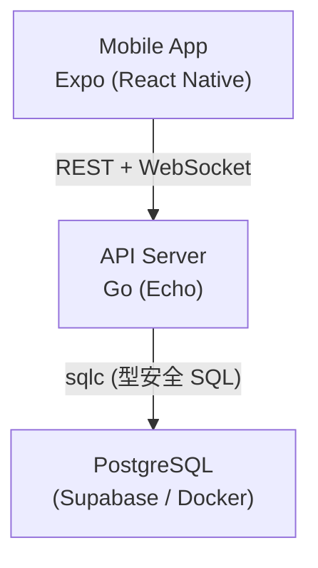
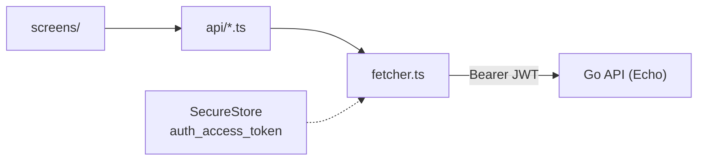
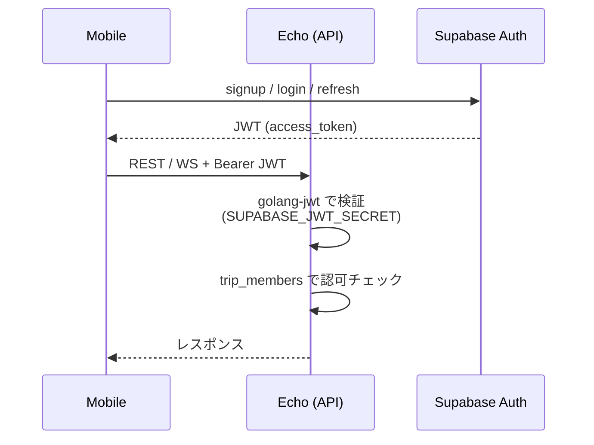
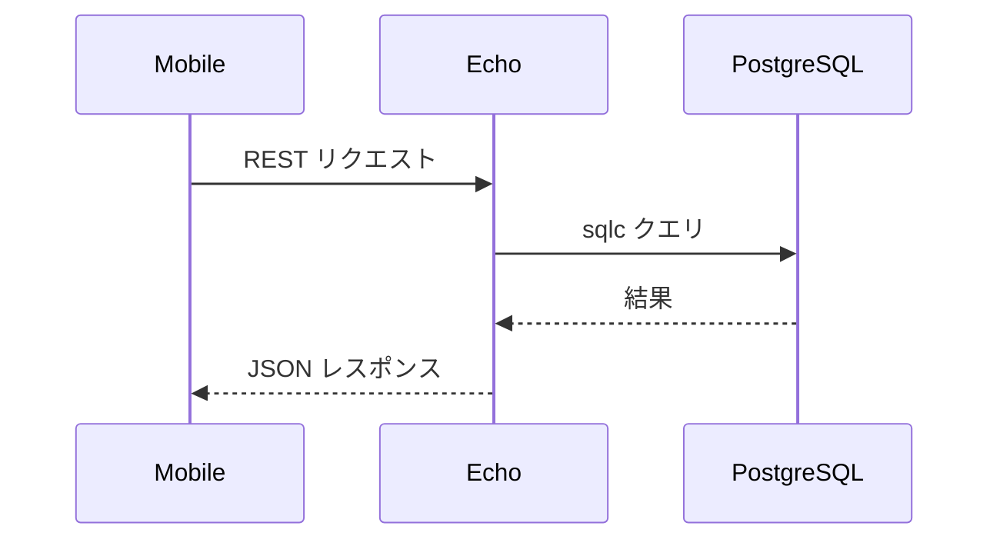
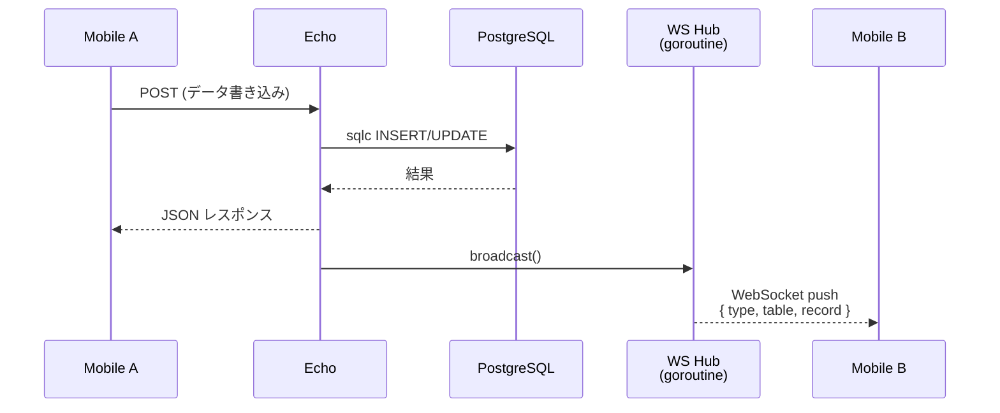
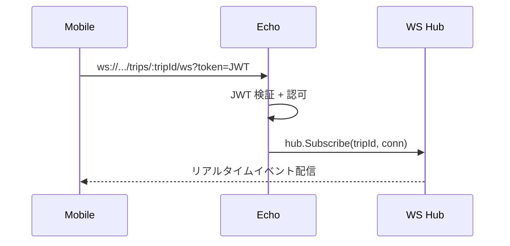
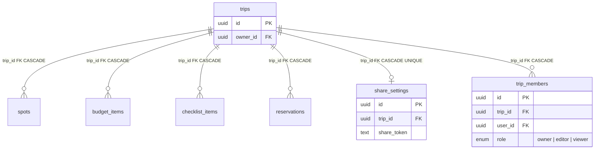

# アーキテクチャ

## 全体構成



Mobile は API サーバーとだけ通信する（単一エントリポイント）。
Supabase は PostgreSQL + Auth（ユーザー管理）として利用。
リアルタイム配信は Echo WebSocket + goroutine で直接処理する。

## モバイル API クライアント層



- **`fetcher.ts`**: 全 API 呼び出しの共通基盤。`expo-secure-store` から `auth_access_token` を取得し `Authorization: Bearer` ヘッダーに付与
- **`config.ts`**: `EXPO_PUBLIC_API_TUNNEL_URL`（ngrok）→ `expo-constants` の `hostUri`（LAN）→ `localhost` の優先順位で API URL を解決
- **リソース API モジュール** (`trips.ts`, `spots.ts`, `budgetItems.ts`, `checklistItems.ts`, `reservations.ts`, `shares.ts`): 各 CRUD 操作を型安全な関数として提供
- **カスタム Hooks**: `useFocusData` でフォーカス時データ取得を抽象化、`useDeleteConfirmation` で削除確認 + 楽観的 UI 更新
- **画面連携パターン**: `useFocusData` でフォーカス時にデータ再取得、楽観的更新 + ロールバック（チェックリスト等）、`saving` state でボタン制御

## 認証・認可



- **認証**: Supabase Auth が JWT を発行。API は `SUPABASE_JWT_SECRET` + `golang-jwt` でローカル検証
- **認可**: `trip_members` テーブルでロールベースアクセス制御（owner > editor > viewer）
- **Auth API**: signup / login / refresh は Supabase Auth REST API に fetch で直接通信
- **レート制限**: 認証エンドポイント（signup / login / refresh）は IP ベースの固定ウィンドウ制限（Echo ミドルウェア）

## モノレポ構成

```
trip-plan-app/
├── apps/
│   ├── api/           # バックエンド API (Go)
│   │   ├── cmd/server/main.go    # エントリポイント
│   │   ├── internal/
│   │   │   ├── handler/          # ルートハンドラ
│   │   │   ├── middleware/       # JWT 認証・認可・レート制限
│   │   │   ├── ws/               # WebSocket ハブ・ブロードキャスト
│   │   │   └── config/           # 環境変数・設定
│   │   ├── db/
│   │   │   ├── query/            # sqlc SQL クエリ (.sql)
│   │   │   ├── sqlc.yaml         # sqlc 設定
│   │   │   └── generated/        # sqlc 生成コード
│   │   ├── go.mod
│   │   └── go.sum
│   ├── mobile/        # モバイルアプリ
│   │   ├── App.tsx
│   │   ├── biome.json
│   │   ├── package.json
│   │   └── src/
│   │       ├── api/            # API クライアント
│   │       ├── components/     # UI コンポーネント
│   │       ├── contexts/       # AuthContext, TripContext
│   │       ├── hooks/          # useFocusData, useDeleteConfirmation
│   │       ├── screens/        # 画面
│   │       ├── navigation/
│   │       ├── theme/
│   │       └── types/
│   └── supabase/      # Supabase ローカル設定
│       ├── config.toml
│       ├── seed.sql
│       └── migrations/
├── .env.example
├── .editorconfig
└── lefthook.yml
```

## データフロー

### CRUD 操作



### リアルタイム共同編集



API 自身が書き込み元なので DB 変更検知は不要。
書き込みハンドラ内で `broadcast()` を呼び、goroutine ベースの Hub でトリップルームの全クライアントに配信する。

### WebSocket 接続



## 認可マトリクス

| リソース | GET | POST/PUT | DELETE |
|---------|-----|----------|--------|
| trips | viewer（一覧はメンバーフィルタ） | editor | owner |
| spots / budgetItems / checklistItems / reservations | viewer | editor | editor |
| shareSettings | owner | owner | owner |
| tripMembers | viewer | - (共有リンク参加) | owner |

## 技術選定の理由

| 技術 | 理由 |
|------|------|
| Go (Echo) | 高い並行処理性能（goroutine）、シングルバイナリデプロイ、低メモリ消費。共同編集の多数同時接続に強い |
| sqlc | SQL から型安全な Go コードを自動生成。ORM のオーバーヘッドなく、生 SQL の柔軟性を維持 |
| Supabase (PostgreSQL + Auth) | PostgreSQL + ユーザー認証を一括提供。ローカル開発が容易 |
| Echo WebSocket | gorilla/websocket ベース。goroutine で効率的な pub/sub を実装 |
| Expo | React Native のビルド・デプロイを簡素化。OTA アップデート対応 |

## DB スキーマ



全テーブルの主キーは UUID。子テーブルは親 trip の削除時にカスケード削除される。
`trip_members` の `role` は `owner | editor | viewer` の ENUM で認可制御に使用。
